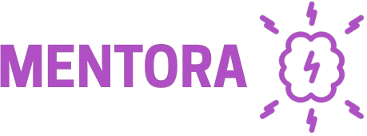

<h1 align="center">
    <picture>
        
    </picture>
</h1>

<p align="center">
    <br>
    <a href="https://opensource.org/licenses/MIT">
        
    </a>
    <a href="https://github.com/YakshithK/mentora/stargazers">
        
    </a>
    <a href="https://github.com/YakshithK/mentora/network/members">
        
    </a>
    <a href="https://github.com/YakshithK/mentora/issues">
        
    </a>
    <a href="https://github.com/YakshithK/mentora/commits/main">
        
    </a>
</p>

## 🧠 What is Mentora?

**Mentora** is an AI-powered essay grading and feedback platform designed to support critical thinking without replacing it. Built on the philosophy that AI should assist—not replace—human thought, Mentora provides constructive evaluation for student-written essays while keeping the human in the loop.

The system is trained on real human-written content, scrubbed of AI-generated feedback, to ensure authenticity and avoid reinforcing synthetic patterns. It's part of a broader effort to encourage intellectual growth by helping students understand their writing rather than outsourcing their thinking.

## ⚙️ Tech Stack

Mentora uses the following programming languages: **Typescript** and **Python**

- **Next.js** – Frontend framework for building fast, scalable web apps.
- **Hugging Face Transformers** – Pre-trained models and NLP utilities.
- **PyTorch** – Deep learning module for training the essay grading neural network.
- **NumPy** - Data processing module for cleaning the training and testing data
- **gRPC** - Allows for quick and seamless multi programming language communication between mircoservices and services like backend.

## 🚀 Features

- Essay submission interface
- Automated, human-trained grading engine
- Feedback generation with critical thinking emphasis
- MIT licensed, open-source


## 📂 Project Structure

```plaintext
.github/  → GitHub assets (logo, workflows)
platform/ → The NextJS project (frontend, backend)
ai-grader-mircoservice/  → The gRPC service that hosts the Neural Network (ai prediction)
ai-scripts/ → Scripts that were used in training/developing Mentora's AI models (python scripts)
```
